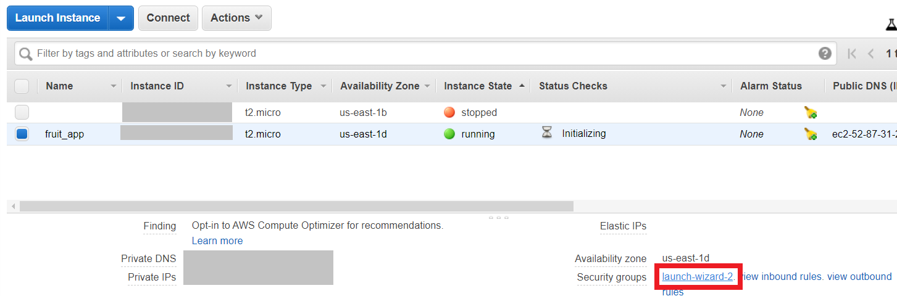
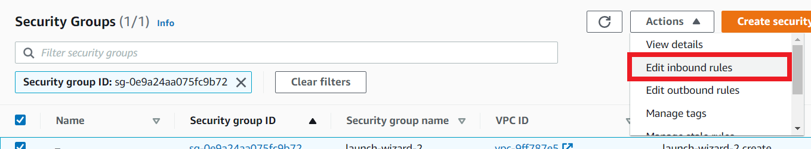
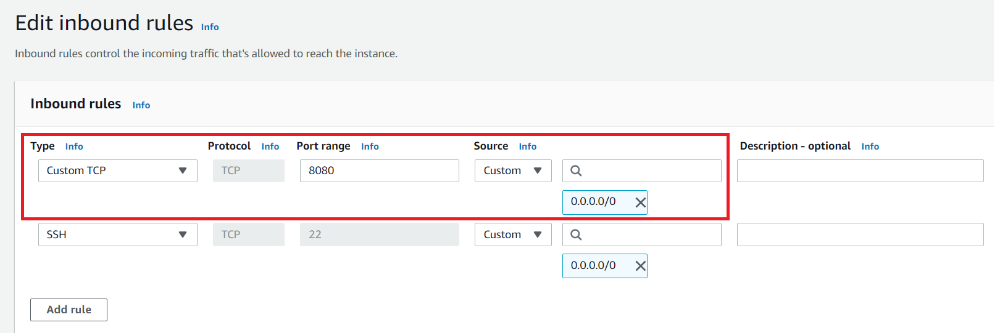

# Fruit Web App: A Celebration of Fruit
## Flask app which renders facts and images related to fruit. 


This web application renders a homepage with a Bootstrap carousel of 5 random fruit 
and related facts.

### There are 2 key modules to this project:

### 1. [src/app.py](https://github.com/Kremzeeq/fruit_app_project/blob/master/src/app.py)

* This main module is configured to [src/config.py](https://github.com/Kremzeeq/fruit_app_project/blob/master/src/config.py)
* A FLASK_ENV variable should be exported as 'development' for the localhost or 'production' for deployment purposes e.g.  
`export FLASK_ENV=production`
* Basically, the app can be run by executing `python3 app.py`
* The first time you run the app, you will need to update the mongo database 
with fruits and facts to render for the homepage.
* Running the **database updater** module as explained below, will ensure that it is populated

### 2. [src/database_updater.py](https://github.com/Kremzeeq/fruit_app_project/blob/master/src/database.updater.py)

* This app will automatically run from app.py, so long as `UPDATE_FRUIT_AND_FACTS = True` is so in the config file.
* This can be set to False if updating the database is not required 
* When executed, this module reads a CSV from [src/static/data_source/fruit.csv](https://github.com/Kremzeeq/fruit_app_project/blob/master/src/static/data_source/fruit.csv).
* The CSV contains tabular information for fruits and facts.
* This information is split between different pandas dataframes.
* The dataframes are converted to json format as per required by 
the fact and fruit models saved here: [src/models](https://github.com/Kremzeeq/fruit_app_project/blob/master/src/models)
* They are then saved to the database.


## Deploying web application to remote Ubuntu virtual machine e.g. EC2 instance

This entails 4 sections:

1. [Setting up the basics](https://github.com/Kremzeeq/fruit_app_project#section-1-setting-up-the-basics)
2. [Setting up credentials for the mongo database](https://github.com/Kremzeeq/fruit_app_project#section-2-setting-up-credentials-for-the-mongo-database)
3. [Exporting variables and running the Flask app](https://github.com/Kremzeeq/fruit_app_project#section-3-export-variables-and-run-flask-app)
4. [Stopping Instances](https://github.com/Kremzeeq/fruit_app_project#section-3-export-variables-and-run-flask-app)

### Section 1: Setting up the basics

1. Once E2 instance is up and running, update the system:

`sudo apt-get update`

2. Next, clone the git hub project:

`git clone https://github.com/Kremzeeq/fruit_app_project.git`

3. Check for python3 version. This project has been developed using Python 3.7.5:

`python3 -v`

4. Install pip3:

`sudo apt install python3-pip`

5. Now, modules listed in [requirements.txt](https://github.com/Kremzeeq/fruit_app_project/blob/master/requirements.txt) can be installed
from within ~/fruit_app_project$:

`pip3 install -r requirements.txt`

6. Ensure to install mongo. Official instructions from mongo db can be found [here](https://docs.mongodb.com/manual/tutorial/install-mongodb-on-ubuntu/)

### Section 2: Setting up credentials for the mongo database

This section is adapted from [@balasubramanim's hackermoon article](https://www.hackernoon.com/how-to-install-and-secure-mongodb-in-amazon-ec2-in-minutes-90184283b0a1).
The purpose of this is to secure the MongoDB instance for the application.

1. Create the path for storing the database data and set permission so yourself as a user can access it. 
Let's call this terminal -'terminal 1':

```
sudo mkdir -p /data/db
sudo chown $USER /data/db
```

2. In another terminal - 'terminal 2' for the EC2 instance, start the mongod instance:

```
mongod --port 27017 --dbpath /data/db
```

3. In terminal 1, start up the Mongo shell, use the admin database

```
mongo --port 27017
use admin
```


4. Now, we can create an admin user with the userAdminAnyDatabase role. 
This permission means that the admin can create and modify users and roles for 
any database available on the port. 
More information on MongoDB access privileges can be found [here](https://studio3t.com/knowledge-base/articles/mongodb-users-roles-explained-part-1/)


```
db.createUser({user: "admin", pwd: "adminUser123", roles: [{role: "userAdminAnyDatabase", db: "admin"}]})`
```

**NB** : Please provide username and password as per preferences. MongoDB encrypts the password within the database.

5. Press `Ctrl+C` to quit the instances in terminals 1 and 2

6. In terminal 1, restart the mongod instance with the --auth command:

```
mongod --auth --port 27017 --dbpath /data/db`
```

7. In terminal 2, access the mongo instance with the admin login details:

```
mongo --port 27017 -u "admin" -p "adminUser123" --authenticationDatabase "admin"` 
```

8. The next step is to create a user with readWrite privileges for the production database, noted as 
'celebration_of_fruit_production' in the config file. Again, set up the fruit_app_user credentials as seen fit
and note the username and password will be required later:

```
use celebration_of_fruit_production
db.createUser({user: "fruit_app_user", pwd: "fruit123", roles: [{role: "readWrite", db: "celebration_of_fruit_production"}]})
```

9. Please note the 'celebration_of_fruit_production' database can be directly
read and written to using the fruit_app_user credentials in another instance:

```
mongo --port 27017 -u "fruit_app_user" -p "fruit123" --authenticationDatabase "celebration_of_fruit_production"
```

*NB* : Remember to quit the mongo and mongod instances with `Ctrl+C`

## Section 3: Exporting variables and running the Flask app

The config file requires for some variables to be exported within the command line. 
Please ensure this is done from within the src directory from where app.py will be run...

1. First, let's export the fruit_app_user credentials

```
export FRUIT_APP_DB_USERNAME=fruit_app_user
export FRUIT_APP_DB_PASSWORD=fruit123
```

2. Now let's export the FLASK_ENV variable for production:

```
export FLASK_ENV=production
```

2. In the AWS EC2 console, select the fruit_app instance and 
select the launch wizard listed under Security groups:



3. Within the Security Groups pane, select 'edit inbound rules':



4. Add an inbound rule for Custom TCP, with a Port Range of 8080 and set the host to 0.0.0.0/0 (as the connection is only IP4):



5. In the EC2 instance, from the src directory, execute the following to run the mongo db instance as a background process:

```
nohup mongod --port 27017 &
```

This creates a nohup.out file in the home directory. The & helps free up the terminal you are typing in.

6. In a separate terminal from the src location, the python Flask application can also be run:

```
python3 app.py
```

**NB** : The waitress module is used within app.py to serve the application for production purposes. 
This is to overcome the warning: "WARNING: This is a development server. Do not use it in a production deployment.
Use a production WSGI server instead." Basically, waitress functions as a WSGI server. More info can be found 
[here](https://stackoverflow.com/questions/51025893/flask-at-first-run-do-not-use-the-development-server-in-a-production-environmen)

7. We can check the instance is running by pasting the IPV4 public IP e.g. 35.154.90.20 in the browser with 
the port number e.g. 8080

```
http://35.154.90.20:8080/
```

Running the application for the first time, will populate the database with information on fruit and facts. 

8. Now, let's stop the flask instance. Execute the following to list system processes:

```
sudo netstat -lp
```

This will show information for many applications, including python, such as in the example below:

```
Proto Recv-Q Send-Q Local Address           Foreign Address         State       PID/Program name             
tcp        2      0 localhost:5000          0.0.0.0:*               LISTEN      15726/python
```

9. Considering the PID number above as 15726, the following command can be executed:

```
sudo kill -9 15726
```

10. In the src directory, edit the config file so UPDATE_FRUIT_AND_FACTS is set to FALSE. 
This is so the database will not be updated every time the application is run. 

```
sudo nano config.py
```

11. Now the the application can be run as a background process with 'nohup' and '&'. 
This is so the web application will still be available via the web, even if the terminal is closed:

```
nohup python3 app.py &
```

12. Time to check the instance is running again! This is regard to details as explained in step 7. 

```
http://35.154.90.20:8080/
```

## Section 4: Stopping instances

Whilst the EC2 instance can be stopped via the AWS console, the following command can help identify processes running 
as background processes:

```
sudo netstat -lp
```

The program numbers can be identified and killed by a similar process as explained in steps 8 and 9 in Section 3. 